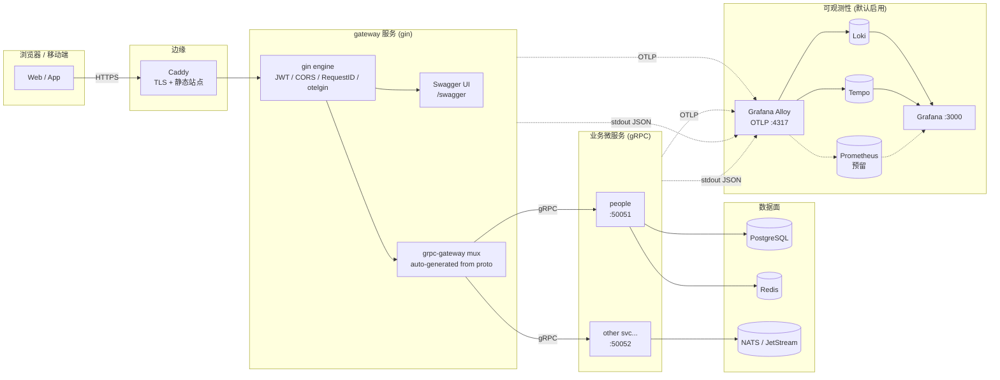

# webx

> 一个面向中小型业务的 Go 微服务平台脚手架：**gRPC + Protobuf** 内部通信，**gin + grpc-gateway** 统一对外，**OpenTelemetry → Alloy → Loki/Tempo/Grafana** 一站式可观测，**docker compose** 一键启动。

---

## 1. 项目定位

webx 是一个 **monorepo** 形态的 Go 微服务工程框架，目标是让一个小团队能够：

- 用同一份 `.proto` 文件同时驱动 **gRPC 内部调用**、**REST 外部 API** 和 **Swagger 文档**；
- 用同一个 `app.Module` 抽象插拔基础设施（日志、数据库、缓存、OTel、gRPC server/client、HTTP server）；
- 用同一份 `docker-compose` 把业务服务和可观测性栈一起跑起来，开发体验等于线上拓扑的缩小版；
- 在中小规模下保持简单，未来需要 Kubernetes / Prometheus / 多集群时也不需要推倒重来。

---

## 2. 总体架构



要点：

1. **入口收敛**：外部 HTTP 流量只有 Caddy → gateway 一条路；服务之间一律 gRPC。
2. **路由零代码**：gateway 不手写 REST handler，`grpc-gateway` 从 `google.api.http` 注解自动生成 mux。
3. **可观测性单出口**：每个服务只跟 `alloy:4317` 说话，Alloy 内部扇出到 Loki / Tempo /（未来）Prometheus。
4. **日志即追踪**：`slog` 输出 JSON，里面带 `trace_id` / `span_id`，Grafana 里可以从 Tempo trace 一键跳到对应 Loki 日志行。

---

## 3. 仓库布局

```
webx/
├─ app/                          # 框架核心: Application / Module / Context / RunService
├─ modules/                      # 可复用基础设施模块, 实现 app.Module
│  ├─ logs/                      #   slog 日志 (text/json, 自动注入 trace 上下文)
│  ├─ postgres/                  #   sqlx + sql-migrate + squirrel + pgx
│  ├─ redis/                     #   go-redis UniversalClient
│  ├─ otel/                      #   OTel SDK: tracer/meter + OTLP exporter + slog handler
│  ├─ grpcserver/                #   gRPC server: 拦截器 / health / reflection / 优雅停止
│  ├─ grpcclient/                #   gRPC dial 工厂: otelgrpc + keepalive + retry
│  └─ ginserver/                 #   gin engine: otelgin / recovery / cors / request-id
├─ pkg/                          # 公共库, 不实现 app.Module
│  ├─ grpcerr/                   #   domain error ↔ gRPC status ↔ HTTP status 映射
│  └─ authmd/                    #   JWT 校验 + outgoing/incoming metadata 工具
├─ proto/                        # Proto 源文件 (单一可信源)
│  └─ <svc>/v1/*.proto           #   强制 v1/ 目录, 便于未来 v2 共存
├─ proto_go/                     # buf 生成产物 (Git 跟踪, 减少 CI 依赖)
│  └─ <svc>/v1/                  #   *.pb.go *_grpc.pb.go *.pb.gw.go *.swagger.json
├─ internal/                     # 业务实现 (一服务一目录)
│  ├─ <svc>/
│  │  ├─ cmd/main.go             #   入口: NewApplication + Install(...modules)
│  │  ├─ model/                  #   领域模型 / DB 行结构 (sqlx db tag)
│  │  ├─ dao/                    #   持久化, 依赖 modules/postgres
│  │  ├─ api/                    #   业务用例 (Service), 不感知 gRPC/HTTP
│  │  └─ server/                 #   gRPC adapter: 实现 *ServiceServer, 注册到 grpcserver
│  └─ gateway/
│     ├─ cmd/main.go
│     ├─ router/                 #   gin 路由装配 + grpc-gateway mux 挂载
│     ├─ middleware/             #   JWT / CORS / RequestID / 错误转换
│     └─ handlers/               #   非 gRPC 的少量原生 HTTP handler (上传, SSE 等)
├─ resources/                    # 运行期资源 (SQL 迁移等)
│  └─ <svc>/V*.sql               #   sql-migrate 格式
├─ docker/                       # 部署
│  ├─ docker-compose.yml         #   业务栈 (caddy/postgres/redis/nats/services)
│  ├─ docker-compose.obs.yml     #   可观测性 override (alloy/loki/tempo/grafana)
│  ├─ Caddyfile
│  ├─ init-db.sh
│  └─ observability/             #   alloy/loki/tempo/grafana 的配置与 provisioning
├─ scripts/                      # 开发脚本 (proto 生成, lint, 一键 dev)
├─ buf.yaml | buf.gen.yaml       # Protobuf 工具链配置
├─ go.mod | go.sum
└─ README.md
```

> **约定**：`internal/<svc>/cmd/main.go` 永远只做 `NewApplication` + `Install`，不写业务；业务一律放 `api/`，gRPC adapter 只做参数映射。

---

## 4. 通信协议：gRPC + Protobuf + buf

### 4.1 Proto 目录与版本

- 路径规范：`proto/<svc>/v<N>/*.proto`，例如 `proto/people/v1/server.proto`。
- `option go_package = "github.com/dafsic/webx/proto_go/<svc>/v<N>;<svc>v1";`
- 增加字段属于兼容变更；删除/改语义必须新建 `v2/`。

### 4.2 工具链：buf

`buf.yaml`：

```yaml
version: v2
modules:
  - path: proto
deps:
  - buf.build/googleapis/googleapis
  - buf.build/grpc-ecosystem/grpc-gateway
lint:
  use: [DEFAULT]
breaking:
  use: [FILE]
```

`buf.gen.yaml`：

```yaml
version: v2
plugins:
  - remote: buf.build/protocolbuffers/go:v1.34.2
    out: proto_go
    opt: paths=source_relative
  - remote: buf.build/grpc/go:v1.5.1
    out: proto_go
    opt: [paths=source_relative, require_unimplemented_servers=false]
  - remote: buf.build/grpc-ecosystem/gateway:v2.22.0
    out: proto_go
    opt: paths=source_relative
  - remote: buf.build/grpc-ecosystem/openapiv2:v2.22.0
    out: proto_go
    opt: [allow_merge=true, merge_file_name=webx]
```

常用命令（`scripts/proto.sh` 封装）：

```sh
buf dep update    # 拉远端依赖
buf lint
buf breaking --against '.git#branch=main'
buf generate
```

### 4.3 一个 proto 的样子

```proto
syntax = "proto3";
package people.v1;

import "google/api/annotations.proto";
import "protoc-gen-openapiv2/options/annotations.proto";

option go_package = "github.com/dafsic/webx/proto_go/people/v1;peoplev1";

service PeopleService {
  rpc Login(LoginRequest) returns (LoginResponse) {
    option (google.api.http) = {
      post: "/api/v1/people:login"
      body: "*"
    };
    option (grpc.gateway.protoc_gen_openapiv2.options.openapiv2_operation) = {
      summary: "登录"; tags: "people";
    };
  }
}
```

写完 proto 就同时拥有：gRPC 接口、REST 路由（`POST /api/v1/people:login`）、Swagger 条目。

---

## 5. Gateway：gin + grpc-gateway + Swagger UI

Gateway 是唯一对外的 HTTP 服务，组装方式（伪代码）：

```go
r := gin.New()
r.Use(middleware.RequestID(), middleware.Recovery(), middleware.CORS(),
      otelgin.Middleware("gateway"), middleware.JWT(jwtSecret))

// gRPC clients (依赖注入)
peopleCC := grpcclient.Dial(ctx, "people:50051")

// grpc-gateway mux
gw := runtime.NewServeMux(
    runtime.WithIncomingHeaderMatcher(authmd.IncomingHeaderMatcher),
    runtime.WithErrorHandler(grpcerr.GatewayErrorHandler),
)
peoplev1.RegisterPeopleServiceHandler(ctx, gw, peopleCC)
// 其他服务同样 RegisterXxxHandler(...)

r.Any("/api/*path", gin.WrapH(gw))                       // 所有 REST 走 gw mux
r.StaticFS("/swagger", swaggerui.FS("proto_go/webx.swagger.json"))  // 文档
r.GET("/healthz", func(c *gin.Context) { c.Status(204) })
```

要点：

- **零路由代码**：新增 proto 接口 → `buf generate` → gateway 自动多一个 REST endpoint。
- **JWT 校验在 gateway**：通过后用 `authmd.Inject(ctx, userID, jti)` 把身份塞进 outgoing gRPC metadata；下游服务用 `authmd.From(ctx)` 读出，不再各自验签。
- **错误统一翻译**：业务返回 `pkg/grpcerr` 包装过的 `status.Error`，`runtime.WithErrorHandler` 把它映射成 `{code, message, details}` JSON + 合适的 HTTP 状态码。
- **Swagger**：`buf generate` 合并出单个 `webx.swagger.json`，gateway 通过嵌入式 `swagger-ui-dist` 在 `/swagger/` 提供。

---

## 6. 可观测性：OTLP → Alloy → Loki / Tempo / Grafana

> **默认启用**。`docker compose -f docker-compose.yml -f docker-compose.obs.yml up -d` 一把起。

### 6.1 数据流

| 信号 | 应用侧 | 传输 | Alloy 组件 | 存储 | 查询 |
|---|---|---|---|---|---|
| Trace | `otelgrpc` / `otelgin` / 手工 span | OTLP gRPC :4317 | `otelcol.receiver.otlp` → `otelcol.exporter.otlphttp` | Tempo | Grafana → Explore → Tempo |
| Log | `slog` JSON → stdout (含 `trace_id`/`span_id`) | docker json-file | `loki.source.docker` → `loki.write` | Loki | Grafana → Explore → Loki |
| Metric | OTel meter (后续) | OTLP gRPC :4317 | `otelcol.exporter.prometheus` 或 `prometheus.remote_write` | Prometheus (待加) | Grafana |

Tempo datasource 启用 **Trace to logs**（按 `trace_id` 跳 Loki）和 **Logs to trace**（点日志里的 `trace_id` 跳 Tempo），形成完整闭环。

### 6.2 应用接入

`modules/otel` 提供 `*otel.Provider`，自动：

1. 构造 `TracerProvider` + `MeterProvider`，OTLP gRPC exporter 指向 `--otel-endpoint`。
2. 给 `*slog.Logger` 包一层 handler，对每条 record 取当前 span 的 `trace_id`/`span_id` 作为字段。
3. fx `OnStop` 中 flush + shutdown，防止丢数据。

`modules/grpcserver` / `grpcclient` / `ginserver` 内置 OTel 拦截器，不需要业务关心。

### 6.3 关键 CLI flag（环境变量同名大写）

| Flag | 默认 | 说明 |
|---|---|---|
| `--otel-endpoint` | `alloy:4317` | OTLP target (compose 内域名) |
| `--otel-service-name` | `${app.name}` | resource service.name |
| `--otel-sample-ratio` | `1.0` | 采样比例 |
| `--otel-insecure` | `true` | 内网明文 gRPC |
| `--log-format` | `json` (prod) / `text` (dev) | logs 模块 |

### 6.4 关闭可观测性

`docker compose -f docker-compose.yml up -d`（不带 obs override 即可）。应用会因 OTLP 无法连接打印警告但不影响业务，可设置 `OTEL_SDK_DISABLED=true` 彻底关闭。

---

## 7. 配置约定

- 配置只通过 **CLI flag**（urfave/cli）+ 同名 **环境变量** 传入，不读配置文件。
- Flag 命名：`--<module>-<key>`，环境变量：`<MODULE>_<KEY>`，例如 `--postgres-dsn` / `POSTGRES_DSN`。
- 每个模块自带默认值，本地裸跑 `go run ./internal/people/cmd` 即可工作（默认连 `localhost`）。
- 敏感值（密码、JWT secret）**只走环境变量**，不写默认值。

各模块详细 flag 参见各自 README：[modules/logs](modules/logs/README.md) ・ [modules/postgres](modules/postgres/README.md) ・ [modules/redis](modules/redis/README.md) ・（后续）`modules/otel` / `grpcserver` / `grpcclient` / `ginserver`。

---

## 8. 部署：docker-compose

### 8.1 拓扑

- **业务栈** [docker/docker-compose.yml](docker/docker-compose.yml)：`caddy` `postgres` `redis` `nats` `people` `gateway`。
- **可观测性 override** `docker/docker-compose.obs.yml`：`alloy` `loki` `tempo` `grafana`。
- 共享外部网络 `webx-network`，业务服务通过域名 `postgres` / `redis` / `alloy` 等互通。

### 8.2 启动

```sh
# 一次性
docker network create webx-network
cp .env.example .env   # 写好 POSTGRES_PASSWORD / JWT_SECRET 等

# 日常
docker compose -f docker/docker-compose.yml -f docker/docker-compose.obs.yml up -d

# 仅业务 (临时排查 / CI)
docker compose -f docker/docker-compose.yml up -d
```

### 8.3 端口约定

| 服务 | 容器端口 | 主机暴露 | 用途 |
|---|---|---|---|
| caddy | 80/443 | 80/443 | 公网入口 |
| gateway | 8080 | (caddy 反代) | HTTP API + Swagger |
| people | 50051 | — | 内部 gRPC |
| postgres | 5432 | 127.0.0.1:5432 | 本机调试 |
| redis | 6379 | 127.0.0.1:6379 | 本机调试 |
| alloy | 4317/4318 | — | OTLP 接收 |
| grafana | 3000 | 127.0.0.1:3000 | 仪表盘 |
| loki | 3100 | — | 日志 |
| tempo | 3200 | — | 追踪 |

---

## 9. 开发工作流

### 9.1 新增一个微服务（示例：`order`）

1. 写 proto：`proto/order/v1/{models.proto,server.proto}`，加 `google.api.http` 注解。
2. 生成代码：`scripts/proto.sh`（= `buf lint && buf generate`）。
3. 写 SQL：`resources/order/V001_init.sql`。
4. 实现 `internal/order/{model,dao,api,server}`，`server` 调用 `modules/grpcserver` 注册。
5. 写入口：`internal/order/cmd/main.go` 装载 `logs / otel / postgres / redis / order-api / order-grpc`。
6. 在 gateway 入口加一行 `orderv1.RegisterOrderServiceHandler(ctx, gw, orderCC)`。
7. compose 加 `order:` service，gateway 加 `ORDER_GRPC_ADDR=order:50052` 环境变量。

### 9.2 本地裸跑（无需 docker）

```sh
# 仅起依赖
docker compose -f docker/docker-compose.yml up -d postgres redis

# 跑服务
export JWT_SECRET=devsecret POSTGRES_DSN='postgres://...?sslmode=disable'
export POSTGRES_MIGRATE=up POSTGRES_MIGRATE_DIR=./resources/people
go run ./internal/people/cmd &
go run ./internal/gateway/cmd
```

### 9.3 测试金字塔

- 单测：`api/` 层用 fake dao；`dao/` 层用 testcontainers-go 起一次 postgres。
- 契约测：`buf breaking` 在 CI 中卡 proto 破坏性变更。
- 集成测：compose 起全栈 + `go test ./test/e2e/...` 打 gateway 的 REST。

---

## 10. 路线图

| 阶段 | 内容 | 状态 |
|---|---|---|
| 1 — 框架基线 | `app` 框架 + `modules/{logs,postgres,redis}` + people demo (gRPC Login + JWT + Redis 存 token) | ✅ 已完成 |
| 2 — Proto 与 buf | proto 目录 v1 化、引入 buf、`scripts/proto.sh`、把 `proto_go/people/people.go` 替换为生成产物 | ⏳ 进行中 |
| 3 — 通用 gRPC/HTTP 模块 | 抽出 `modules/grpcserver` `grpcclient` `ginserver`，回收 `internal/people/server` | ⏳ |
| 4 — Gateway | gin + grpc-gateway mux + Swagger UI + JWT 中间件 + `pkg/grpcerr`+`pkg/authmd` | ⏳ |
| 5 — 可观测性 | `modules/otel` + `docker-compose.obs.yml` + Alloy/Loki/Tempo/Grafana provisioning + trace↔log 关联 | ⏳ |
| 6 — 指标 | Alloy 加 `prometheus.remote_write`，服务暴露 OTel meter | 未开始 |
| 7 — CI/CD | GitHub Actions：`buf lint/breaking` + `golangci-lint` + 多服务镜像构建推 ECR | 未开始 |
| 8 — 扩展 | NATS 异步事件、多租户、限流熔断（依业务再定） | 未定 |

---

## 11. 设计取舍备忘

- **gin + grpc-gateway 而不是裸 grpc-gateway**：保留 gin 中间件生态（CORS / RequestID / pprof / 业务专用 handler），仅路由代理给 gateway mux。
- **JWT 集中在 gateway**：下游服务只信 metadata，避免每个服务都拿 secret，旋转更简单。
- **生成代码进 Git**：减小 CI 依赖、IDE 友好；`buf generate` 的产物 diff 用于代码评审。
- **OTLP 统一走 Alloy**：未来想换后端（如 SaaS 的 Honeycomb / Datadog）只改 Alloy 配置，不动应用。
- **不引入 K8s / Helm**：项目定位中小型，docker compose 足够；模块抽象保证将来迁移 K8s 时只改部署层。
- **不引入 service mesh**：流量小，OTel 已经提供链路；mTLS 用 Caddy + 内网网络隔离覆盖。

---

## 12. 模块索引

| 路径 | 一句话职责 |
|---|---|
| [app](app/README.md) | Application + Module + Context + RunService |
| [modules/logs](modules/logs/README.md) | `*slog.Logger`，text/json，运行时可调级别，注入 trace 字段 |
| [modules/postgres](modules/postgres/README.md) | sqlx + pgx + squirrel + sql-migrate，自动迁移 |
| [modules/redis](modules/redis/README.md) | go-redis `UniversalClient`，自动 single/sentinel/cluster |
| `modules/otel`（规划） | OTel SDK + OTLP + slog handler |
| `modules/grpcserver`（规划） | gRPC server + 拦截器 + health + reflection |
| `modules/grpcclient`（规划） | gRPC dial 工厂 + otelgrpc + keepalive |
| `modules/ginserver`（规划） | gin engine + 标准中间件 |
| `pkg/grpcerr`（规划） | error ↔ gRPC status ↔ HTTP status |
| `pkg/authmd`（规划） | JWT + gRPC metadata 工具 |
| [internal/people](internal/people) | 示例业务服务：登录 |
| `internal/gateway`（规划） | HTTP 网关 |
